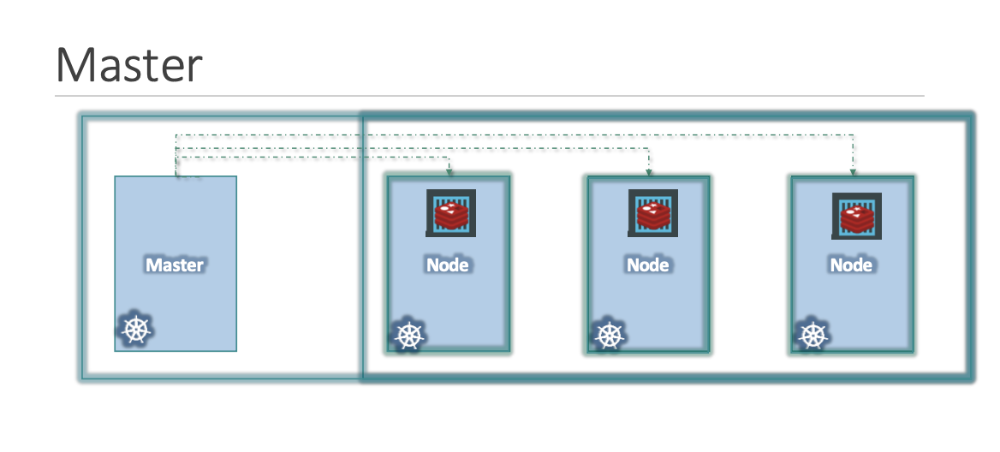
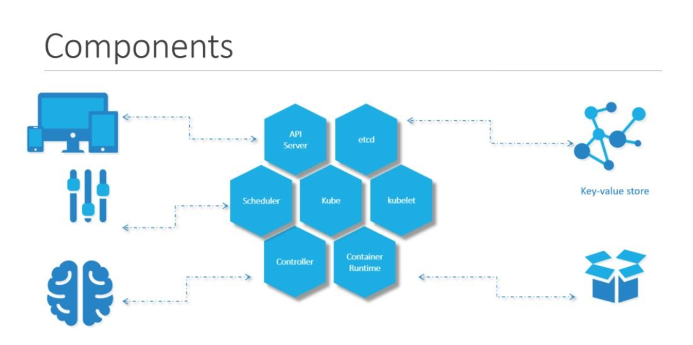
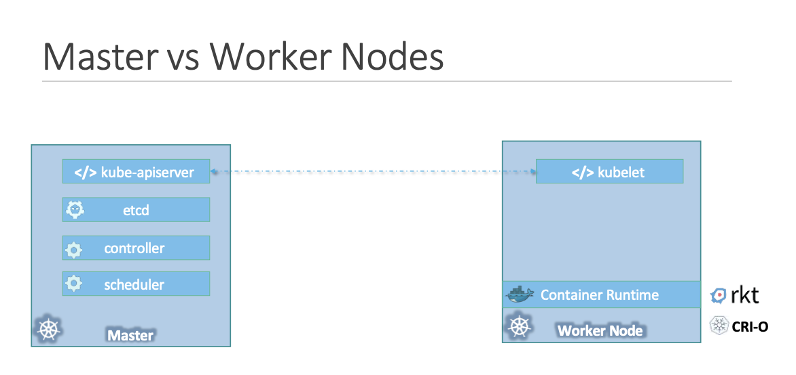
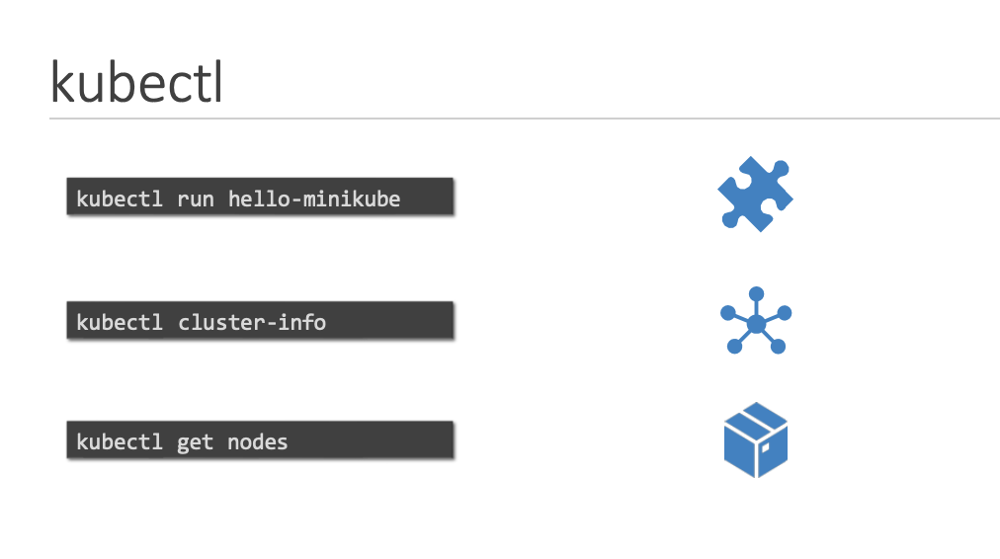
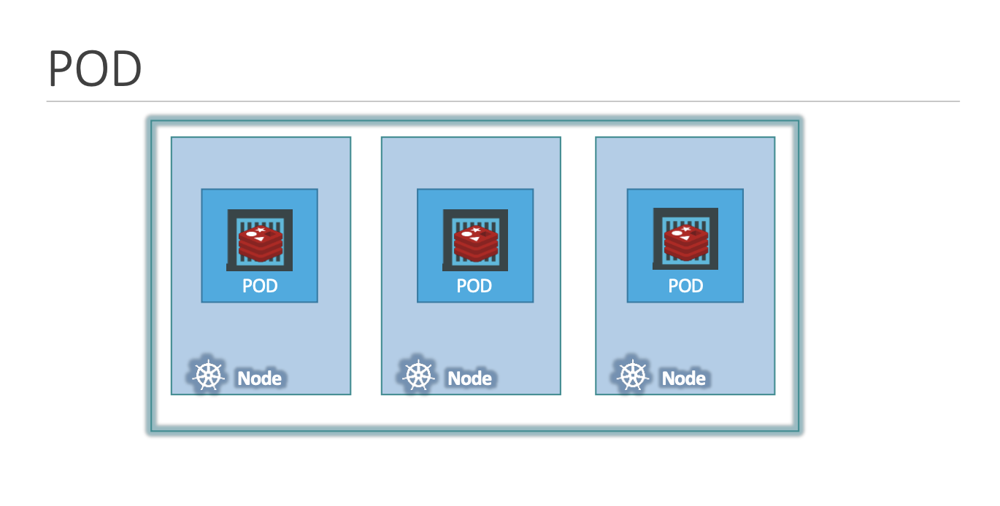
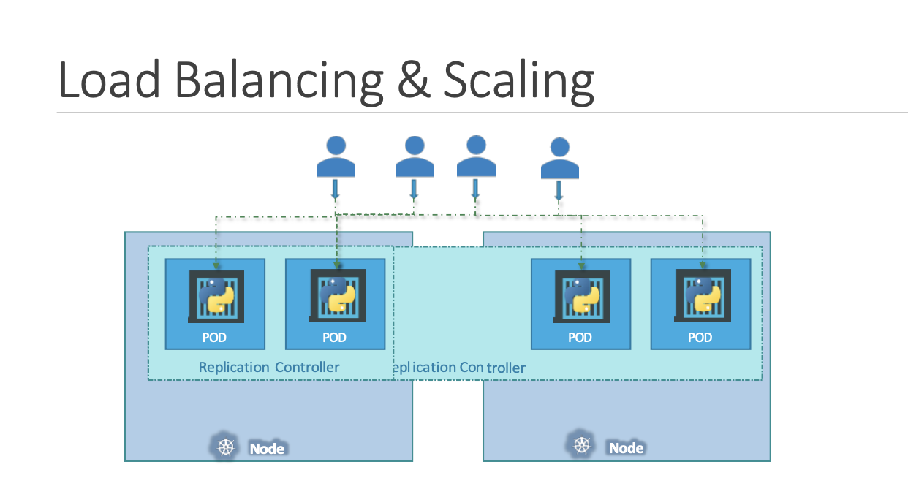

# kubernetes

This repository contains documentation and code samples for using Kubernetes. This is good for beginners who want to learn Kubernetes.

In this repository, you will have a understanding of Kubernetes and how to use it. You will also learn how to deploy a Kubernetes cluster on your local machine using Minikube.

## What is Orchestration?

Orchestration is the automated configuration, coordination, and management of computer systems and software. It helps to manage complex computer systems and services with ease. It is used to manage the lifecycle of containers. It is used to deploy, scale, and manage containerized applications.

## Why do we need Orchestration?

Orchestration is needed to manage the lifecycle of containers. It is used to deploy, scale, and manage containerized applications. It is used to manage complex computer systems and services with ease. It helps to manage complex computer systems and services with ease.

## What is Kubernetes?

Kubernetes is an open-source container orchestration tool developed by Google. It is used to manage the lifecycle of containers. It is used to deploy, scale, and manage containerized applications. It is used to manage complex computer systems and services with ease.

## Why do we need Kubernetes?

Kubernetes is needed to manage the lifecycle of containers. It is used to deploy, scale, and manage containerized applications. It is used to manage complex computer systems and services with ease. It helps to manage complex computer systems and services with ease.

## Terminologies

- **Node**: A node is a worker machine in Kubernetes. It may be a VM or physical machine, depending on the cluster. Each node has the services necessary to run pods and is managed by the master components. The services on a node include Docker, kubelet, kube-proxy, and a container runtime.
- **Cluster**: A cluster is a set of nodes grouped together. One of these nodes is elected as the Master node, and the others are Worker nodes. The Master node manages the cluster and the Worker nodes host the running pods.
- **Master**: A master is a node that controls the cluster. A cluster can have multiple masters for high availability. The master watches for changes on the nodes and pods and makes changes to bring the cluster’s current state to the desired state.


## Components of Kubernetes

- **API Server**: The API server is a key component and serves the Kubernetes API using JSON over HTTP, which provides both the internal and external interface to Kubernetes. The API server processes and validates REST requests and updates state of the API objects in etcd, thereby allowing clients to configure workloads and containers across Worker nodes.

- **etcd**: etcd is a distributed key-value store that is used to store the cluster state. The Kubernetes master writes the cluster state to etcd. If the master crashes, it can read the cluster state from etcd.

- **Scheduler**: The scheduler is a key component and watches for newly created pods that have no node assigned. For every newly created pod, the scheduler selects an appropriate node based on the resource requirements of the pod and the available resources on the node.

- **Controller**: A controller is a key component and runs controllers that are responsible for different functions. These controllers include the replication controller, endpoints controller, namespace controller, and service accounts controller.

- **Container Runtime**: The container runtime is the software that is responsible for running containers. Kubernetes supports several container runtimes: Docker, containerd, CRI-O, and any implementation of the Kubernetes CRI (Container Runtime Interface).

- **Kubelet**: The kubelet is a key component and runs on each Worker node. It communicates with the API server and manages the containers running on the node. It also takes care of node-level operations such as starting pods and containers, and health checks.


## Master vs Worker Node

- **Master Node**: The master node is responsible for managing the Kubernetes cluster. It runs the Kubernetes control plane processes, including the API server, scheduler, and controller manager. The master node communicates with worker nodes to schedule and run containers on them.

- **Worker Node**: The worker node is responsible for running the containers. It runs the kubelet process and is managed by the master node. The worker node communicates with the master node using the Kubernetes API, which the master node exposes.

### How you will determine which node is master and which node is worker?

Worker node have container runtime and kubelet installed on it.
Master node have etcd, kube-apiserver,kube-controller-manager,kube-scheduler installed on it.



## Kubectl

Kubectl is a command-line tool that is used to deploy and manage applications on Kubernetes. It is used to view and manage components in a Kubernetes cluster. It is used to view and manage the state of Kubernetes objects, such as pods, namespaces, deployments, and services.



## Pods

A pod is the smallest unit of deployment in Kubernetes. It is a logical collection of one or more containers that are always co-located and co-scheduled. A pod is a group of one or more containers that share the same IP address and port space, are always co-located, and run in a shared context on the same node.



## YAML in Kubernetes

YAML is a human-readable data serialization language. It is used to write configuration files. It is used to write configuration files for Kubernetes. It is used to write configuration files for Kubernetes objects, such as pods, deployments, and services.

Kubernetes defintion file always contain 4 parts:

- apiVersion
- kind
- metadata
- spec

```yaml
apiVersion: refers to the version of the Kubernetes API you want to use.
kind: refers to the type of object you want to create.
metadata:  refers to the data that uniquely identifies the object.
spec: refers to the desired state of the object.
```

### How to deploy a pod?

You can deploy pods using the commands kubectl run. The kubectl run command creates a deployment, and the kubectl create command creates a pod.

```bash
kubectl run nginx --image=nginx
```

Othe commands for pods are:

```bash
kubectl get pods
kubectl get pods -o wide
kubectl describe pods
kubectl delete pods
```

Another way to deploy a pod is by creating a YAML file. The YAML file contains the configuration of the pod. You can create a YAML file using the command kubectl run --dry-run=client. The YAML file contains the configuration of the pod. You can create a YAML file using the command kubectl run --dry-run=client.

```bash
apiVersion: v1
kind: Pod
metadata:
  name: nginx
spec:
  containers:
  - name: nginx
    image: nginx:1.14.2
    ports:
    - containerPort: 80
```

to deploy the pod using the YAML file, run the command kubectl apply -f pod.yaml.

```bash
kubectl apply -f pod.yaml
```

## Replication Controller

A replication controller is a Kubernetes object that ensures that a specified number of pod replicas are running at any given time. It is used to ensure that a specified number of pod replicas are running at any given time. It is used to ensure that a specified number of pod replicas are running at any given time.

### Load Balancing Scaling

Another reason we need replication controller is to create multiple PODs to share the load across them. For example, in this simple scenario we have a single POD serving
a set of users. When the number of users increase we deploy additional POD to balance the load across the two pods. If the demand further increases and If we were to run out of resources on the first node, we could deploy additional PODs
across other nodes in the cluster. As you can see, the replication controller spans across multiple nodes in the cluster. It helps us balance the load across multiple pods
on different nodes as well as scale our application when the demand increases.


### Replication Controller YAML

```yaml
apiVersion: v1
kind: ReplicationController
metadata:
  name: nginx-rc
spec:
## this will POD Template
  template:
    metadata:
      name: nginx-pod
      labels:
        app: nginx
    spec:
      containers:
      - name: nginx-container
        image: nginx
  replicas: 3
```

### Difference between ReplicaSet and Replication Controller

ReplicaSet is the next-generation Replication Controller. It supports the new set-based selector requirements and label selectors. It is used to ensure that a specified number of pod replicas are running at any given time. It is used to ensure that a specified number of pod replicas are running at any given time.

Selector is replica set is make sure if the pods are created outside the replica set but have the same label as the replica set then it will also manage those pods.
  
  ```yaml
  apiVersion: apps/v1
  kind: ReplicaSet
  metadata:
    name: nginx-rc
  spec:
    template:
      metadata:
        name: nginx-pod
        labels:
          app: nginx
      spec:
        containers:
        - name: nginx-container
          image: nginx
    selector:
      matchLabels:
        app: nginx
    replicas: 3
  ```

### Labels and Selectors

Labels are key/value pairs that are attached to Kubernetes objects. They are used to organize and select subsets of objects. 
Replica set uses labels to identify the set of pods it is responsible for managing.

### Why do you need template section?

Let's say you can use label and selctor to manage the pods for example you created pods from different file and you have used same label and selector in that case replica set will manage those pods as well.
So do you really need template section? Yes, you need template section because you need to define the pod template which will be used by replica set to create the pods if the pods fail.

## Type of Deployment Strategies

- **Recreate/Rebuild**: In this strategy, the existing pods are destroyed and new pods are created. This strategy is used when you want to deploy a new version of your application. 

## Common Commands

- Get all the pods in the cluster

```bash
kubectl get pods
```

- Get all the pods in the cluster with more details

```bash
kubectl get pods -o wide
```

- Get detailed information about a pod

```bash
kubectl describe pod <pod-name>
```

- Apply yaml file

```bash
kubectl apply -f <file-name>
```

- Create ReplicaSet

```bash
kubectl create -f <file-name>
```

- Update replicas

```bash
kubectl scale --replicas=6 -f <file-name>
OR
kubectl replace -f <file-name>
```

- Describe ReplicaSet

```bash
kubectl describe replicaset <replicaset-name>
```